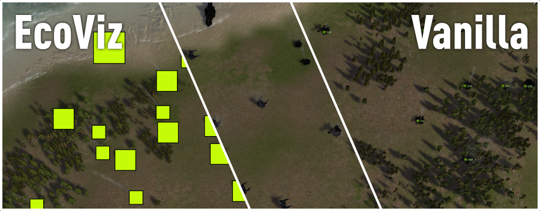
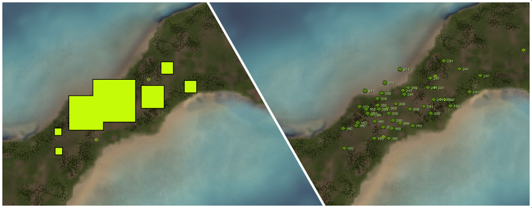
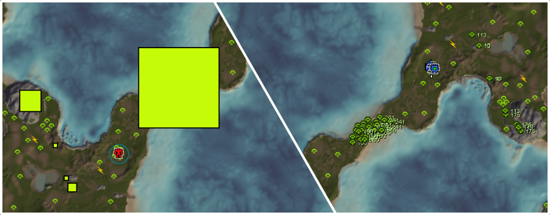

Eco Visualizer
==============

A more visual way of showing reclaim.

Installation
------------

1. Open your mod folder. You can directly open it in FAF under 'Options' -> 'Show Paths...' -> 'Show mods folder'. It is usally something like `C:\Users\YOUR_USER\Documents\My Games\Gas Powered Games\Supreme Commander Forged Alliance\Mods\`.

2. Clone this repository there.

    `git clone https://github.com/iliis/EcoViz.git`

3. Enable the mod. You can do this in FAF in the 'Vaults' -> 'Mods' tab under 'Manage UI Mods'. You can also enable it from the in-game lobby under 'Options' -> 'Mods'.

Usage
-----

This mod replaces the classical reclaim points that are shown when holding 'Ctrl' and 'Shift'.
Note that the game can freeze for a moment when rendering large updates (such as showing the plot for the first time on a map with a lot of reclaim).

Known Limitations
-----------------

* Display culling is done using the middle of a bubble, which causes big bubbles to dissapear at the screen edges.
* Initialization can be slow. On maps with a lot of reclaim (such as 'Wonder' or 'Desert Joust') it will take a few seconds to build up the internal datastructures.
* Updates are only done when the user shows the reclaim map (i.e. holds 'Ctrl-Shift'). This has the advantage that the visualization does not affect runtime at all when it isn't shown, but the disadvantage that more work has to be done when showing the reclaim map (as all the changes when the map was hidden have to be applied).
* Not everything that can be reclaimed is shown, as the game engine simply doesn't provide it.
* Stuff that is already partially reclaimed will still be shown as having the full amount. This is again a limitation of the game engine which doesn't provide this information to the UI layer.

Further Ideas
-------------

* Show sub-points in bigger clusters to give an idea if the big bubble consists of a lot of small ones or if there are one or two big single items (like experimental wrecks)
  Issues:
    * Knapsack-Algorithm for filling big rectangle with multiple small ones? Should be fast, but can be inaccurate
    * How to render this efficiently? Drawing lines as separate GUI elements is probably too much. Rendering a texture would be nice but looses pixel-accuracy when zooming.